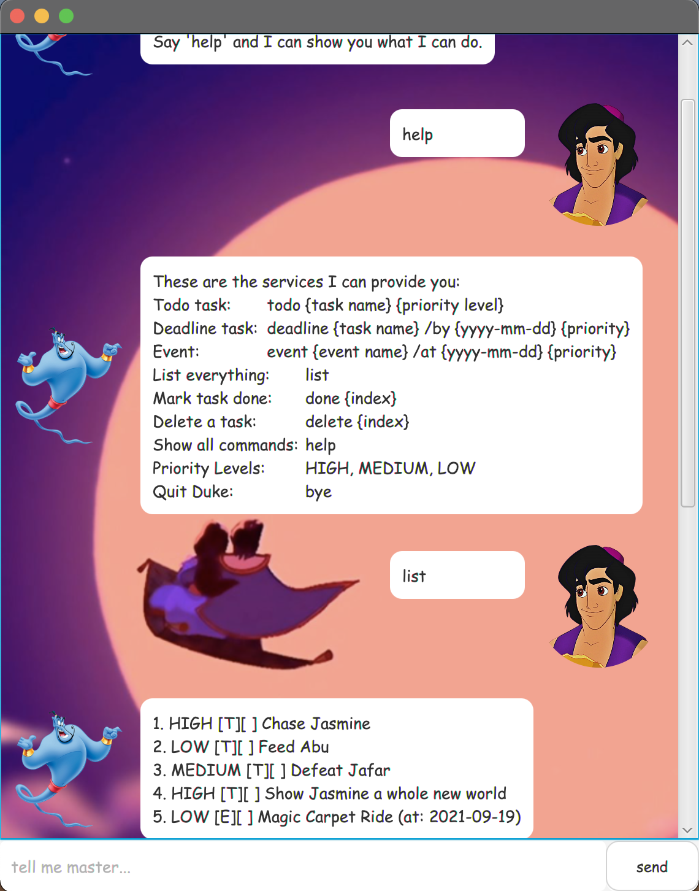
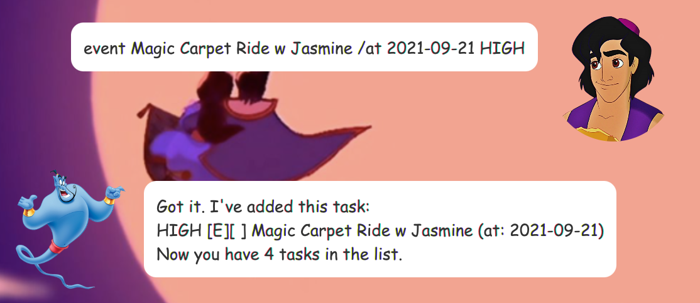
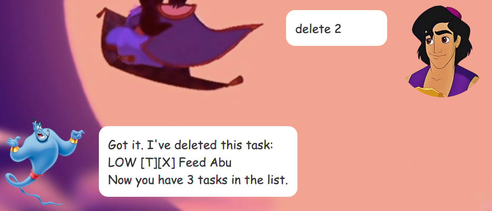
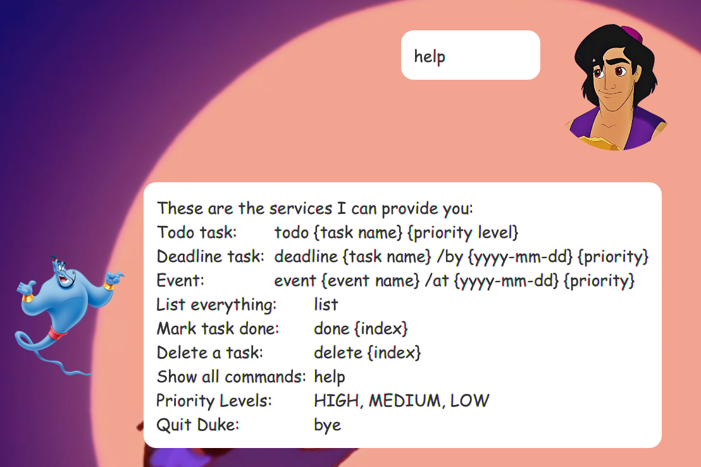
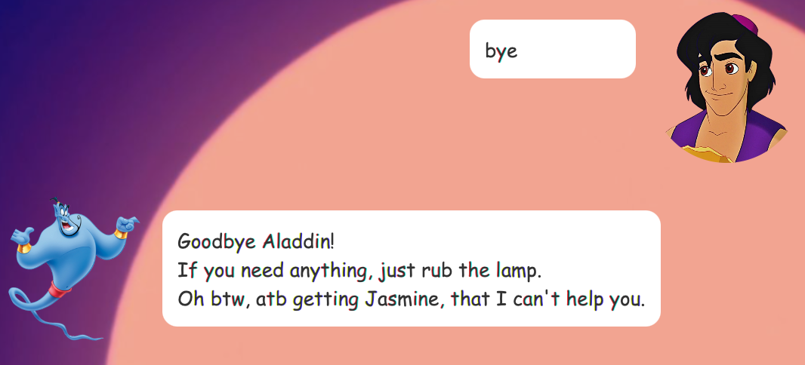

# User Guide

#🧞‍♂
️Genie is a **desktop app for managing your genie.tasks, optimised used via a Command Line Interface (CLI)** while 
still having the benefits of a Graphical User Interface (GUI).

###💡 Note about the command format
* Words in ```UPPER_CASE``` are the parameters to be supplied by the user.
  e.g. ```todo TASK```, ```TASK``` is a parameter which can be used as ```todo eat dinner```.
  



* [Features](#features)
  * [Adding a todo](#adding-a-todo-todo)
  * [Adding a deadline](#adding-a-deadline-deadline)
  * [Adding a event](#adding-a-event-event)
  * [Listing all task](#listing-all-task-list)
  * [Marking a task as done](#marking-a-task-as-done-done-index)
  * [Deleting a task](#deleting-a-task-delete-index)
  * [Locating a task](#locating-a-task-find-keyword)
  * [Show all commands](#show-all-commands-help)
  * [Show tasks of certain priority](#show-tasks-of-certain-priority-show-priority-level)
  * [Exiting the program](#exiting-the-program-bye)
  
  

## Features

The genie.Genie is powerful enough to help you do the following: 

* Add a new genie.tasks to you task list
* View all the genie.tasks you have
* Mark a task as completed
* Delete a task
* Find task(s) based on keywords
* Save and load your genie.tasks automatically from your hard drive
* Add priority to genie.tasks
* View task list by priority level

[comment]: <> (## Usage )

### Adding a todo: ```todo```
Adds a todo task to the list

*Format:* ```todo TASK PRIORITY LEVEL```

* Assign priority level to task.
* Available priority levels are HIGH, MEDIUM & LOW.
* Tasks with no specified priority level will by default be of LOW priority

*Examples*

* ```todo Chase Jasmine HIGH```
* ```todo Feed Abu```


### Adding a deadline: ```deadline```

Adds a deadline to the task list.

*Format:* ```deadline TASK /by DATE```

* Assign priority level to deadlines.
* Available priority levels are HIGH, MEDIUM & LOW.
* Deadlines with no specified priority level will by default be of LOW priority


*Examples*

* ```deadline Learn to ride magic carpet /by 2021-09-19```


### Adding a event: ```event```

Adds an event to the task list.

*Format:* ```event EVENT /at DATE TIME(OPTIONAL)```

*Examples*

* ```event Magic Carpet Ride w Jasmine /at 2021-09-21 HIGH```



### Listing all task: ```list```

List all the genie.tasks that are both completed and not completed.

*Format:* ```list```


###Marking a task as done: ```done INDEX```

Mark task as done.

Format: ```done INDEX```

* Mask the task at the specified index as done.
* Index must be a positive integer greater than 0. 
* The index refers to the number in the list.

*Examples*

* ```list``` followed by ```done 2``` to mark the first task on the list as done.


###Deleting a task: ```delete INDEX```

Deleting a specified task from the list.

*Format:* ```delete INDEX```

* Deleting the task at the specified index.
* Index must be a positive integer greater than 0.
* The index refers to the number in the list.

*Examples*

* ```list``` followed by ```delete 2``` to delete the first task on the list.



### Locating a task: ```find KEYWORD```

Find genie.tasks that contains the given index.

*Format:* ```find KEYWORD```

*Examples*

* ```find Jasmine``` 


### Show all commands: ```help```

Show all the available commands and formats for the user input that the genie.Genie understands.

*Format:* ```help```

Expected outcome: 



### Show tasks of certain priority: ```show PRIORITY LEVEL```

Show all the tasks that are of the indicated priority level.

*Format:* ```show PRIORITY LEVEL```
* Priority levels are HIGH, MEDIUM & LOW

*Examples*

* ```show HIGH```


### Exiting the program: ```bye```

Exits the program.

Format: ```bye```




### Saving the data

All the genie.tasks added to the list are automatically saved to the hard drive, 
no manual editing is needed. The next time the app is opened, your genie.tasks 
will still appear when you enter the ```list``` command.
